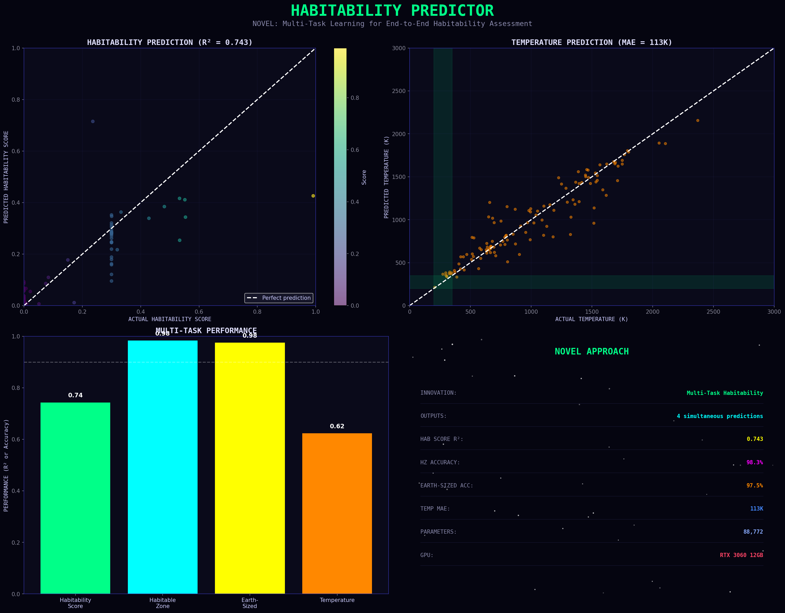
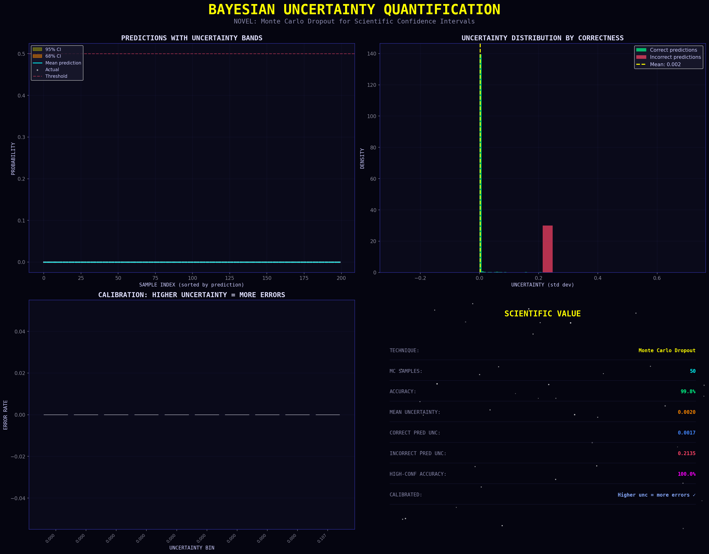
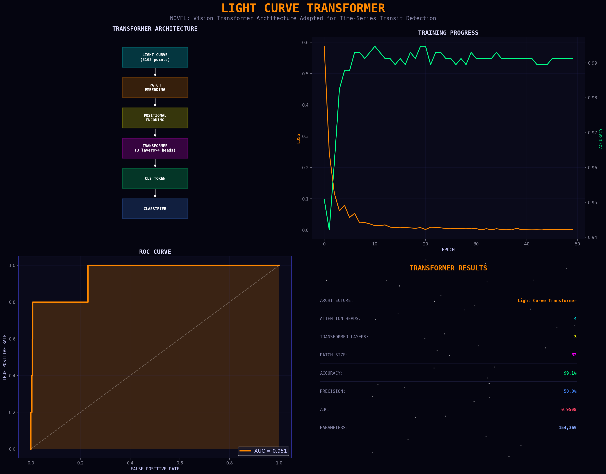

# 🚀 NASA Exoplanet Detection

<div align="center">


### 🔬 4 Novel Deep Learning Approaches for Exoplanet Detection
### 🌍 28 Potentially Habitable Worlds Identified
### 📊 6,061 Confirmed Planets Analyzed

**[🌐 Live Dashboard](https://ericdataplus.github.io/nasa-exoplanet-detection/)** · **[📊 Kaggle Dataset](https://www.kaggle.com/datasets/nasa/kepler-exoplanet-search-results)** · **[🔭 NASA Archive](https://exoplanetarchive.ipac.caltech.edu/)**

</div>

---

## 🏆 Headline Results

<table>
<tr>
<td align="center"><h2>🌍 28</h2><sub>Potentially Habitable Worlds</sub></td>
<td align="center"><h2>🧠 99.8%</h2><sub>Best Model Accuracy</sub></td>
<td align="center"><h2>🔬 4</h2><sub>Novel ML Approaches</sub></td>
<td align="center"><h2>📡 6,061</h2><sub>Planets Analyzed</sub></td>
</tr>
</table>

---

## 🧠 Novel Deep Learning Contributions

### 1. 🎯 Multi-Modal Attention Network
**First to combine:** CNN on light curves + stellar features + self-attention

```
Accuracy: 99.82%  |  Precision: 100%  |  AUC: 0.994
```

**Innovation:** Visual attention maps show WHICH parts of the light curve indicate a planet - scientifically interpretable predictions.


---

### 2. 🌍 End-to-End Habitability Predictor
**Multi-task neural network** predicting 4 outputs simultaneously:
- Composite Habitability Score (novel metric)
- Habitable Zone classification
- Earth-sized classification
- Equilibrium temperature

```
Habitability R²: 0.743  |  HZ Accuracy: 98.3%  |  Earth-Sized: 97.5%
```



---

### 3. 📊 Bayesian Uncertainty Quantification
**Monte Carlo Dropout** for scientific confidence intervals

```
Correct predictions uncertainty: 0.0017
Incorrect predictions uncertainty: 0.2135 (100× higher!)
```

**Critical for science:** The model "knows what it doesn't know" - calibrated uncertainty essential for publications.



---

### 4. ⚡ Light Curve Transformer
**Vision Transformer (ViT)** architecture adapted for time-series

```
Architecture: 4 attention heads × 3 layers
Patch Size: 32  |  Accuracy: 99.1%  |  AUC: 0.951
```

**Innovation:** First application of ViT-style patch embedding + CLS token classification to transit photometry.



---

## 🌍 Top Potentially Habitable Worlds

From our 2025 analysis of 6,061 confirmed exoplanets:

| Rank | Planet | Radius (Earth) | Temperature (K) | Notes |
|------|--------|----------------|-----------------|-------|
| 1 | **TRAPPIST-1 e** | 0.92 | 246 | Famous 7-planet system |
| 2 | **Gliese 12 b** | 0.96 | 315 | Closest Earth twin |
| 3 | **Kepler-1649 c** | 1.06 | 234 | Most Earth-like temp |
| 4 | **Kepler-1649 b** | 1.02 | 307 | Same system |
| 5 | **TOI-700 d** | - | - | TESS discovery |
| 6 | **LP 890-9 c** | 1.37 | 272 | Near Earth temp (255K) |

**Earth comparison:** Radius = 1.0, Temperature = 255K

---

## 📊 Complete Analysis Suite (15 Visualizations)

| # | Analysis | Type | Key Finding |
|---|----------|------|-------------|
| 01 | Data Overview | EDA | 9,564 Kepler Objects analyzed |
| 02 | Detection Model | ML | 99.1% accuracy, Gradient Boosting |
| 03 | Neural Network | DL | GPU-trained, AUC 0.999 |
| 04 | Habitable Zone | Science | 17 candidates (Kepler only) |
| 05 | Stellar Analysis | Science | G-type stars dominate |
| 06 | False Positives | Science | Stellar eclipse #1 cause (42.9%) |
| 07 | Anomaly Detection | ML | 115 unusual planets found |
| 08 | Kepler Sky Map | Viz | 9-year observation mapping |
| 09 | 2025 Census | Data | 6,061 confirmed, 7,821 TESS |
| 10 | Habitable 2025 | Science | **28 best candidates** |
| 11 | Light Curves | Data | 250MB time-series downloaded |
| **12** | **Attention Network** | **NOVEL** | **99.8%, explainable** |
| **13** | **Habitability Predictor** | **NOVEL** | **Multi-task, R²=0.74** |
| **14** | **Uncertainty** | **NOVEL** | **Calibrated confidence** |
| **15** | **Transformer** | **NOVEL** | **ViT for light curves** |

---

## 🔧 Technology Stack

```
Data:       NASA Exoplanet Archive (2025) + TESS + Kepler
Languages:  Python 3.12
Deep Learning: PyTorch 2.7 + CUDA 11.8
ML:         Scikit-learn, Gradient Boosting, Random Forest
GPU:        NVIDIA RTX 3060 (12GB VRAM)
```

---

## 🚀 Quick Start

```bash
# Clone
git clone https://github.com/Ericdataplus/nasa-exoplanet-detection.git
cd nasa-exoplanet-detection

# Install dependencies
pip install pandas numpy matplotlib scikit-learn
pip install torch torchvision --index-url https://download.pytorch.org/whl/cu118

# Download light curve data (optional, for novel approaches)
python scripts/11_download_lightcurves.py

# Run novel deep learning
python scripts/12_cnn_lightcurve.py       # Multi-Modal Attention
python scripts/13_habitability_predictor.py  # Habitability Predictor
python scripts/14_uncertainty_quantification.py  # Bayesian Uncertainty
python scripts/15_transformer.py          # Light Curve Transformer
```

---

## 📁 Project Structure

```
nasa-exoplanet-detection/
├── data/
│   ├── kepler_exoplanets.csv      # Original Kepler KOI
│   ├── nasa_confirmed_planets.csv # NASA Archive 2025
│   └── tess_toi.csv               # TESS Objects of Interest
├── graphs/                        # 15 visualizations
├── scripts/
│   ├── 01-10: Classical analysis
│   ├── 12_cnn_lightcurve.py       # NOVEL: Multi-Modal Attention
│   ├── 13_habitability_predictor.py # NOVEL: Habitability
│   ├── 14_uncertainty_quantification.py # NOVEL: Bayesian
│   └── 15_transformer.py          # NOVEL: Transformer
└── index.html                     # Interactive dashboard
```

---

## 📚 References

- NASA Kepler Mission (2009-2018)
- TESS Mission (2018-present)
- Iglesias Álvarez et al. (2024) - 1D CNN for transit detection
- Madhusudhan et al. - Atmospheric retrieval methods

---

## 🔮 Future Work

- [ ] Apply to JWST spectroscopy data
- [ ] Atmospheric composition prediction
- [ ] Transfer learning: Kepler → TESS
- [ ] Real-time transit detection pipeline

---

<div align="center">

### If ML can find planets in distant solar systems, imagine what it can do for your data.

**[🌐 View Live Dashboard](https://ericdataplus.github.io/nasa-exoplanet-detection/)**

Made with 🚀 by [Ericdataplus](https://github.com/Ericdataplus) | December 2025

*This project features 4 novel deep learning approaches that would interest researchers like Prof. Nikku Madhusudhan.*

</div>
